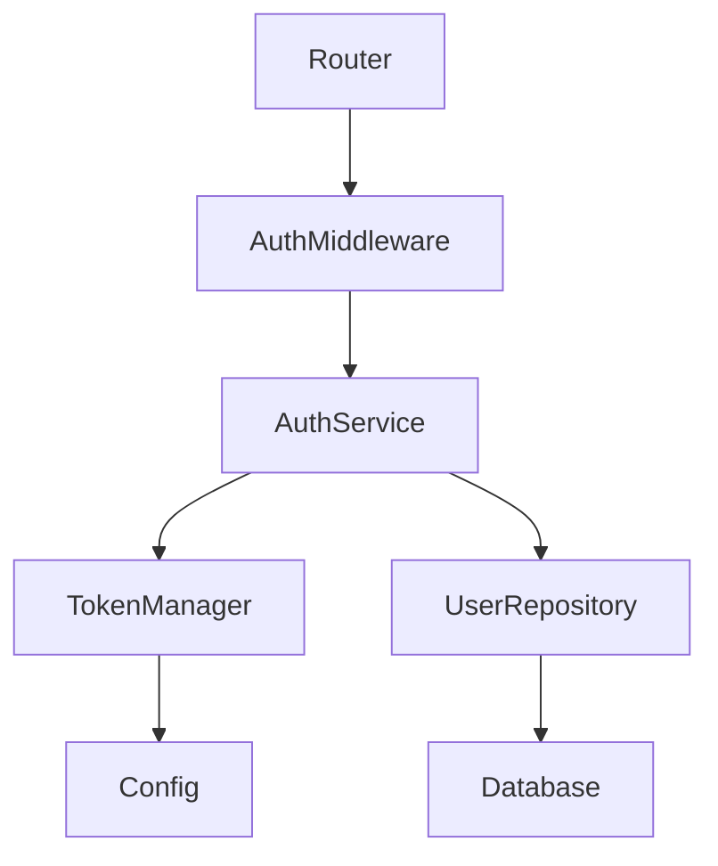

# Understand a Codebase

You've just cloned an unfamiliar repository. Here's how to use CodeGraph to understand it quickly.

## The Scenario

You're joining a new team or reviewing an open-source project. You need to understand:
- What the project does and how it's organized
- Where key functionality lives
- How components connect to each other
- What's important and what's peripheral

## Step 1: Get the Big Picture

**You:** "What is this project and how is it structured?"

**Claude calls:**
```
codegraph_structure(top_n: 20)
```

**What you see:** A PageRank-ranked list of the most important symbols in the project, with file counts, language breakdown, and detected frameworks.

```
Project Structure
  Files: 127
  Symbols: 843
  Languages: TypeScript (65%), Python (20%), Go (15%)
  Frameworks: React, Express, Django

  Top symbols by importance:
    1. AuthService.authenticate  (PageRank: 0.032)
    2. Database.connect           (PageRank: 0.028)
    3. UserRepository.findById    (PageRank: 0.025)
    ...
```

The symbols with the highest PageRank are the ones most depended on. They form the backbone of the project.

## Step 2: Explore a Specific Feature

**You:** "How does authentication work in this project?"

**Claude calls:**
```
codegraph_query(query: "authentication login token", limit: 10)
```

**What you see:** Ranked search results combining keyword relevance with semantic similarity. Each result includes the symbol name, file path, kind, and a relevance score.

**Then Claude calls:**
```
codegraph_callers(symbol: "AuthService.authenticate", depth: 2)
```

**What you see:** Everything that calls `authenticate`, and what calls those callers. This maps out the authentication flow from entry points to implementation.

```
AuthService.authenticate
  <- AuthMiddleware.validate (src/middleware/auth.ts:23)
    <- Router.handleRequest (src/routes/api.ts:15)
    <- WebSocketHandler.onConnect (src/ws/handler.ts:8)
  <- LoginController.login (src/controllers/login.ts:42)
    <- Router.handleRequest (src/routes/api.ts:22)
```

## Step 3: Map Dependencies

**You:** "What does the database module depend on?"

**Claude calls:**
```
codegraph_dependencies(symbol: "Database.connect", depth: 2)
```

**What you see:** Forward dependencies: what `Database.connect` calls and imports.

```
Database.connect
  -> Config.getDatabaseUrl (src/config/index.ts:5)
  -> Logger.info (src/utils/logger.ts:12)
  -> ConnectionPool.create (src/db/pool.ts:8)
    -> Config.getPoolSize (src/config/index.ts:18)
```

## Step 4: Understand Impact

**You:** "What breaks if I change the User model?"

**Claude calls:**
```
codegraph_impact(target: "src/models/user.ts")
```

**What you see:** The blast radius of changing that file.

```
Impact Analysis: src/models/user.ts
  Risk:                 high
  Direct dependents:    8
  Transitive dependents:23
  Affected files:       12
    - src/repositories/user-repository.ts
    - src/services/auth-service.ts
    - src/controllers/user-controller.ts
    - src/middleware/auth.ts
    ...
```

High-impact files require careful changes. Low-impact files are safe to refactor aggressively.

## Step 5: Check What's Unused

**You:** "Is there any dead code in this project?"

**Claude calls:**
```
codegraph_dead_code(kind: "function")
```

**What you see:** Symbols with zero incoming edges that aren't entry points or exports.

```
Potentially unused functions:
  - legacyAuth (src/auth/legacy.ts:15)
  - formatCurrency (src/utils/format.ts:89)
  - migrateV1Data (src/scripts/migrate.ts:22)
```

These might be candidates for cleanup, or they might be invoked through dynamic dispatch. Use your judgment.

## Step 6: Visualize

**You:** "Show me a dependency diagram for the auth module"

**Claude calls:**
```
codegraph_diagram(target: "AuthService", depth: 2, direction: "both")
```

**What you see:** A Mermaid diagram showing the call graph around `AuthService`.



## Step 7: Detect Frameworks

**You:** "What frameworks and libraries does this project use?"

**Claude calls:**
```
codegraph_frameworks(dir: ".")
```

**What you see:** Frameworks detected from manifest files (package.json, Cargo.toml, requirements.txt, etc.).

```
Detected frameworks:
  - React 18.2.0 (from package.json)
  - Express 4.18.2 (from package.json)
  - Django 4.2.0 (from requirements.txt)
  - PostgreSQL (from package.json: pg)
```

## Tools Used in This Workflow

| Tool | Purpose |
|------|---------|
| `codegraph_structure` | Project overview with PageRank-ranked symbols |
| `codegraph_query` | Find symbols by keyword and semantic similarity |
| `codegraph_callers` | Reverse call graph -- what calls this? |
| `codegraph_dependencies` | Forward dependencies -- what does this call? |
| `codegraph_impact` | Blast radius -- what breaks if this changes? |
| `codegraph_dead_code` | Find potentially unused symbols |
| `codegraph_diagram` | Mermaid dependency/call graph visualization |
| `codegraph_frameworks` | Detect project frameworks |
| `codegraph_languages` | Language breakdown statistics |

## Tips

1. **Start broad, then narrow.** Begin with `structure` to see the forest, then use `query` and `callers` to drill into specific trees.

2. **Follow the PageRank.** High-PageRank symbols are the load-bearing walls of the codebase. Understand these first.

3. **Use impact before refactoring.** Before changing anything, run `impact` to understand what else depends on it.

4. **Let the agent explore.** Ask questions and let Claude choose which tools to use. It will combine multiple tools to build a complete picture.

## Sample Prompts

```
"Give me an overview of this codebase"
"What are the main components and how do they interact?"
"Find all the API endpoints"
"How is data validated before reaching the database?"
"What's the relationship between User and Order models?"
"Show me the dependency graph for the auth module"
"Where is configuration loaded from?"
"What's the most important code in this project?"
```

## Related Workflows

- [Fix a Bug](fix-a-bug.md) -- Debug issues with call graph context
- [Security Audit](security-audit.md) -- Scan for vulnerabilities
